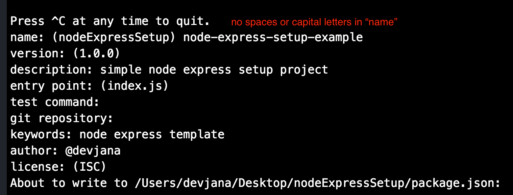
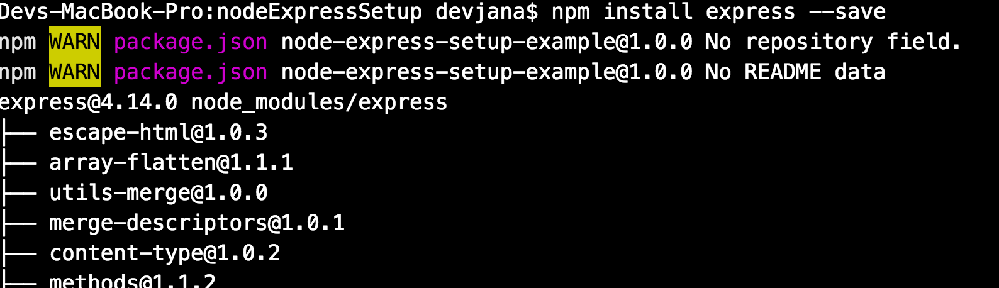
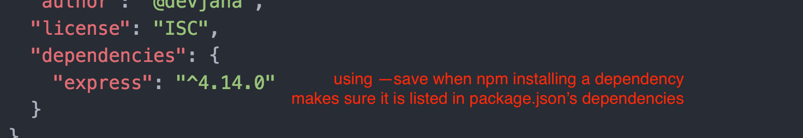
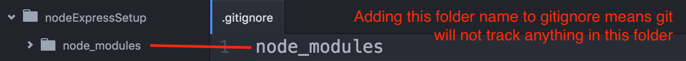
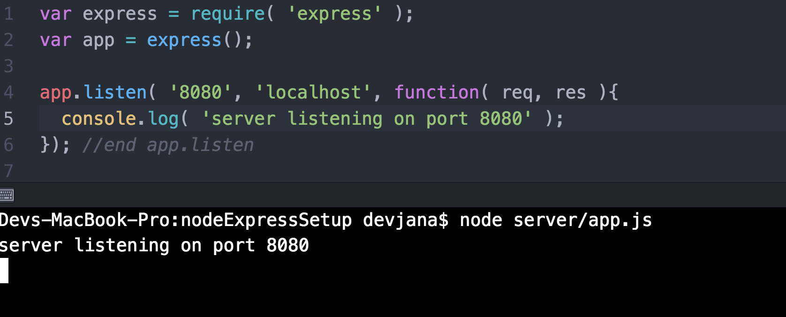
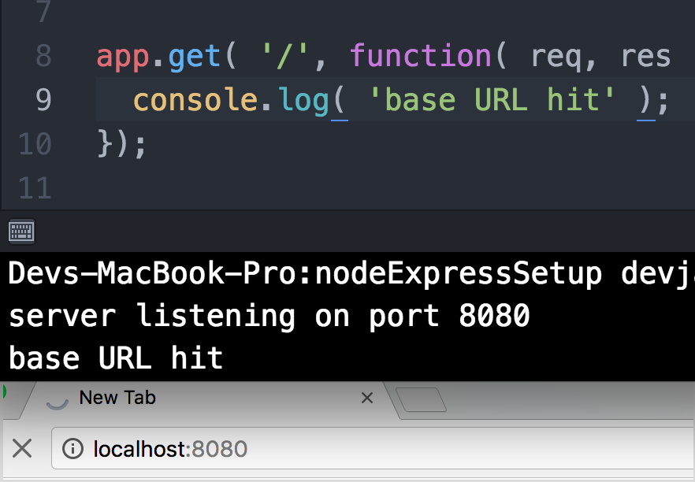
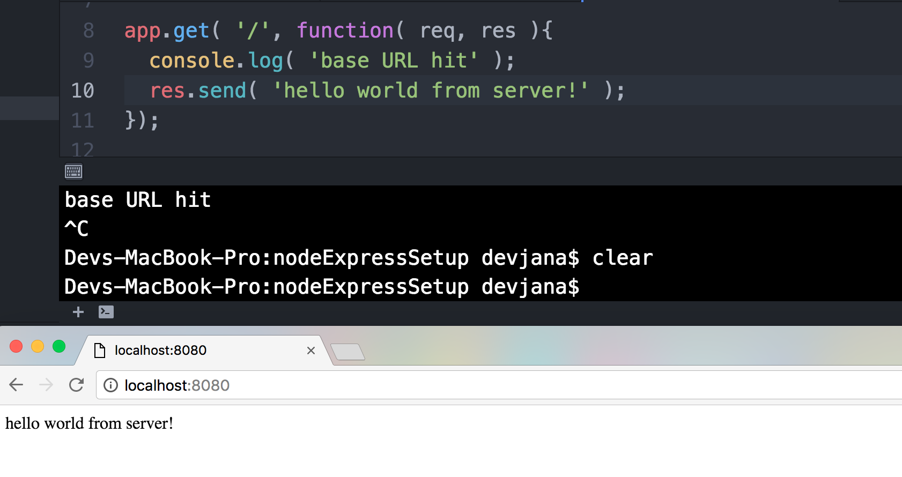

Node Express setup
==================

In this project we'll set up a basic NodeJS and Express project. Later, we'll be adding JQuery to this project. Our objective here is to set up a basic project using these technologies and set up a simple localhost server and a basic site upon which you may build later.

Install NodeJS and NPM
----------------------
First, you'll want to make sure you've got Node and NPM installed: https://nodejs.org/en/download/

Basic Setup
-----------
First, create a folder within which we'll create the project. Next, in terminal, run "npm init" in this folder. You'll be asked a number of questions, many of which you can simply click past with "return", but fill in those which you feel the need to see not remain hollow:


You'll now see a "package.json" file in this folder. More on this later.

For now, let's install the node modules we need. In the console and still in the project folder type the following:

* npm install express --save



You'll see some action in the terminal that as the express module is installed.

You may also note that there is a new folder named 'node_modules' in the project folder now with an "express" folder within. This holds the scripts for 'express' that the project will now use.

If you look at the 'package.json' file now you'll also notice that 'express' along with its version are listed in the 'dependencies' portion of the file now:


Next, let's install 'body-parser' the same way:

* npm install body-parser --save

Regarding .gitignore and dependencies
-------------------------------------
Create a file names ".gitignore" in your project folder. Files and folders listed in this file are ignored by (wait for it...) git. One of the things that 'package.json' does is allow you to NOT upload your node modules to github. They can be installed by anyone so by having them listed in package.json we can add them to .gitignore like so:


When users pull, fork, or otherwise download a project like this one they need only run "npm install" in the command line to install all needed dependencies. Npm will read what the dependencies are from the package.json file and automatically instal them in the project.

Go ahead and give it a shot for yourself... Clone or forked this repo to a new folder. Note that there's no "node_modules" folder. Make sure 'npm init' has been run in the folder and run 'npm install'. You'll see express and body-parser both get installed.

Setting up a VERY basic server
------------------------------
At this point you should be ready to set up a SUPER simple little internet microcosm. You should have NPM installed and a project folder in which NPM init has been run as well as having node and express installed with --save.

First, create a "server" folder in your project folder. Within this "server" folder create an "app.js" file. Open this file and add the following code:

```javascript
var express = require( 'express' );
var app = express();

app.listen( '8080', 'localhost', function( req, res ){
  console.log( 'server listening on port 8080' );
}); //end app.listen
```

When run, this will set up a basic server on port 8080. In terminal in this folder, run the following:
* node server/app.js

You'll see the console log from the code in terminal.



NOTE:
* Client-side console logs show up in browser (as we've seen)
* Server-side console logs appear in the terminal

You can stop a running server by pressing "control+c" in the terminal.

Now that we've got a local server up and running, let's make it capable of actually doing something. Add the following code at the bottom of the app.js file:

```javascript
app.get( '/', function( req, res ){
  console.log( 'base URL hit' );
});
```

This sets up a "get" endpoint for the server at "/". This is the "base URL" for the server. If you spin up your server again ('node server/app.js' in the console) and then open "localhost:8080" in your browser you'll see the "base URL hit" console log in the terminal.



The server now has received a "get" request for some content at the base URL of our server, but isn't sending anything back.

Let's fix that.

Add the following line to our new "app.get" function:
```javascript
res.send( 'hello world from server!' );
```

Place this below the console log command. Now restart the server ('control+c' then 'node server/app.js') and reload 'localhost:8080' in your browser. You should see the hello world from server text in browser now.



We've now set up a REALLY basic server, added a get endpoint, hit that URL from our browser (the client), and sent back some text from the server.
